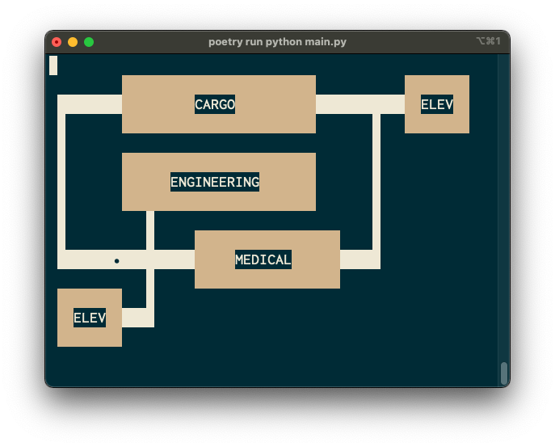

# ALEX (Artificial Life EXperiment)

A game I designed for my Commodore 128 back in the day, but I didn't really have enough experience back then to make it work. 
Now I'm finishing it in Python with some basic terminal graphics, at least for now until I can get the play mechanics where I want them.

## Prerequisites
* At a command prompt in the project directory, type `make install` to set up the project

## To run the tests
* At a command prompt in the project directory, type `make test`.

## To run the game
* At a command prompt in the project directory, type `make run`.

## Game instructions
* Click anywhere on the map with the mouse to move the player to that location.
* Hit the `q` key to quit the game.
* Yes, it's a prototype.
